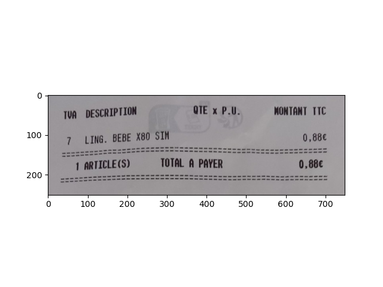
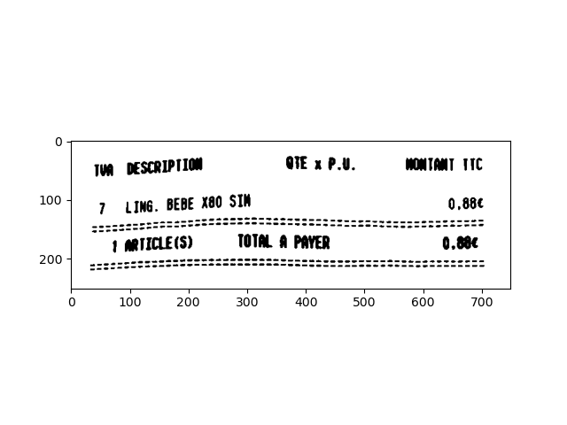
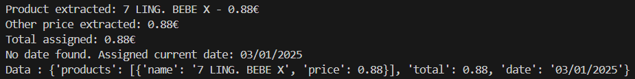

# PyFacture

PyFacture is a Python project designed to automate expense management from receipts. The application utilizes image processing techniques and Optical Character Recognition (OCR) to extract relevant information from a photo of a receipt, such as purchased products, their prices, and the date of purchase.

## Features

- **Image Processing:** Enhances receipt images for better OCR accuracy.
- **Optical Character Recognition (OCR):** Extracts text from receipt images using Tesseract.
- **Data Extraction:** Analyzes OCR text to identify products, prices, and dates.
- **Excel File Management:** Creates and updates Excel files to store extracted data.

## Installation

### 1. Clone the Repository

```bash
git clone https://github.com/yourusername/PyFacture.git
cd PyFacture
```

### 2. Install Dependencies
Install the required Python packages using pip:

```bash
pip install -r requirements.txt
```

### 3. Install Tesseract OCR
PyFacture relies on Tesseract OCR for text extraction.<br>
Follow the instructions below based on your operating system.

### 4. Usage
#### 4.1. Prepare Your Data
Place your receipt images in the "data/input/" directory.<br> 
Ensure that the images are clear, well-lit, and free from distortions for optimal OCR results.


#### 4.2. Run the Application
Execute the main script to process the receipts and extract data:

```bash
python pyfacture/main.py
```


#### 4.3. View the Results
The extracted data will be saved as Excel files in the "data/output/" directory. 

